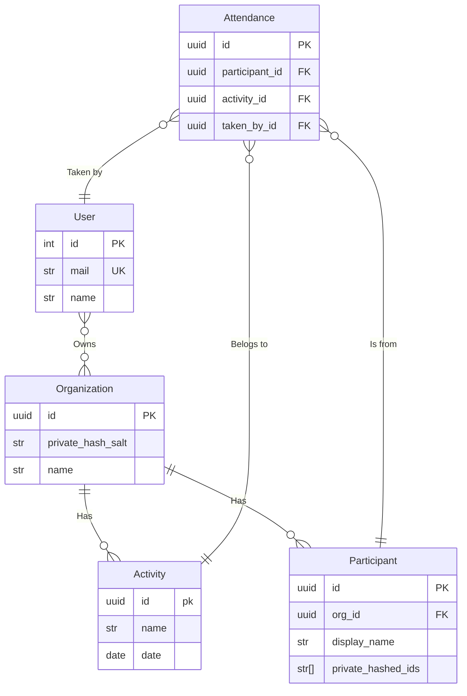

# Entidades

```mermaid
erDiagram
	User {
	    int id PK
	    str mail UK
		str name 	
    }
	Organization {
		uuid id PK
		str  private_hash_salt
		str  name
	}
	Activity {
		uuid id pk
		str name 
		date date
	}
	Participant {
	   uuid id PK
	   uuid org_id FK
	   str display_name
	   str[] private_hashed_ids
	}
	Attendance {
	   uuid id PK
	   uuid participant_id FK
	   uuid activity_id FK
	   uuid taken_by_id FK
	}

	User }o--o{ Organization : Owns
	Organization ||--o{ Activity : Has
	Organization ||--o{ Participant : Has

	Attendance }o--|| Activity : "Belogs to"
	Attendance }o--|| Participant : "Is from"
	Attendance }o--|| User : "Taken by"
```

