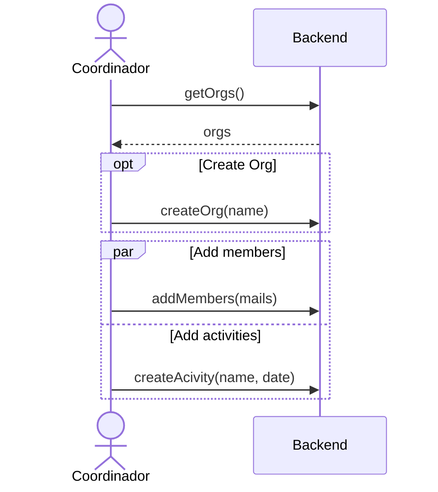
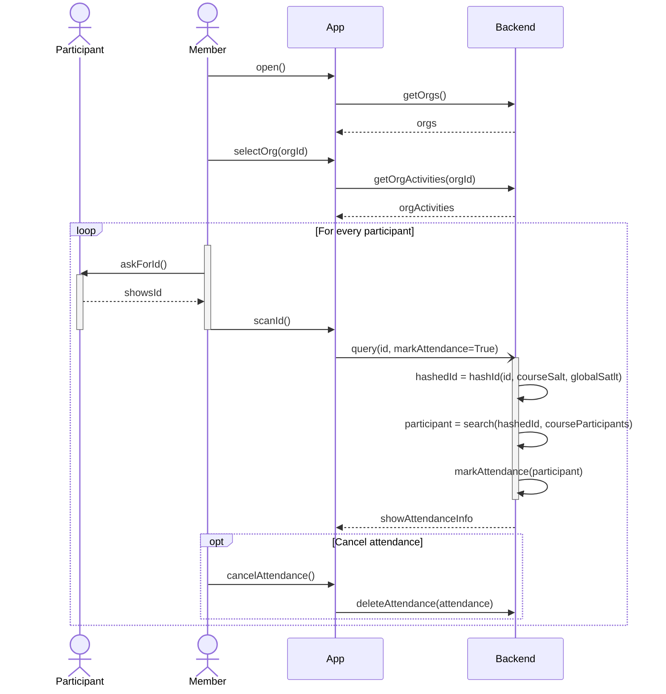

# Diagramas de Secuencia

## Creación de organización

```mermaid
sequenceDiagram
	actor coord as Coordinador
	
	participant back as Backend

	coord->>back: getOrgs()
	back-->>coord: orgs
    
    opt Create Org
		coord->>back: createOrg(name)
	end

	par Add members
		coord->>back: addMembers(mails)
	and Add activities
		coord->>back: createAcivity(name, date)
	end
	
```

## Toma de asistencia

```mermaid
sequenceDiagram
	actor p as Participant
	actor m as Member 
	participant app as App
	participant back as Backend


	m->>app: open()
	app->>back: getOrgs()
	back-->>app: orgs
	m->>app: selectOrg(orgId)

	app->>back: getOrgActivities(orgId)
	back-->>app: orgActivities

	loop For every participant
		activate m
		m->>p: askForId()
		activate p
		p-->>m: showsId
		m->>app: scanId()
		deactivate m
		deactivate p
		app-)back: query(id, markAttendance=True)
		activate back
		back->>back: hashedId = hashId(id, courseSalt, globalSatlt)
		back->>back: participant = search(hashedId, courseParticipants)
		back->>back: markAttendance(participant)
		deactivate back
		back-->>app: showAttendanceInfo

		opt Cancel attendance
			m->>app: cancelAttendance()
			app->>back: deleteAttendance(attendance)
		end
	end
```
